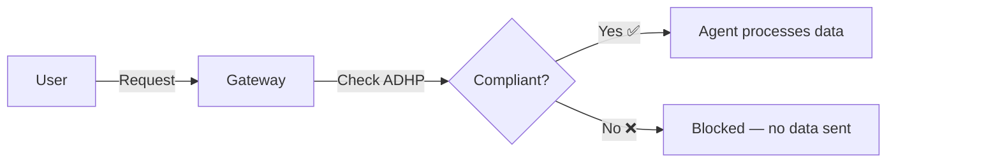
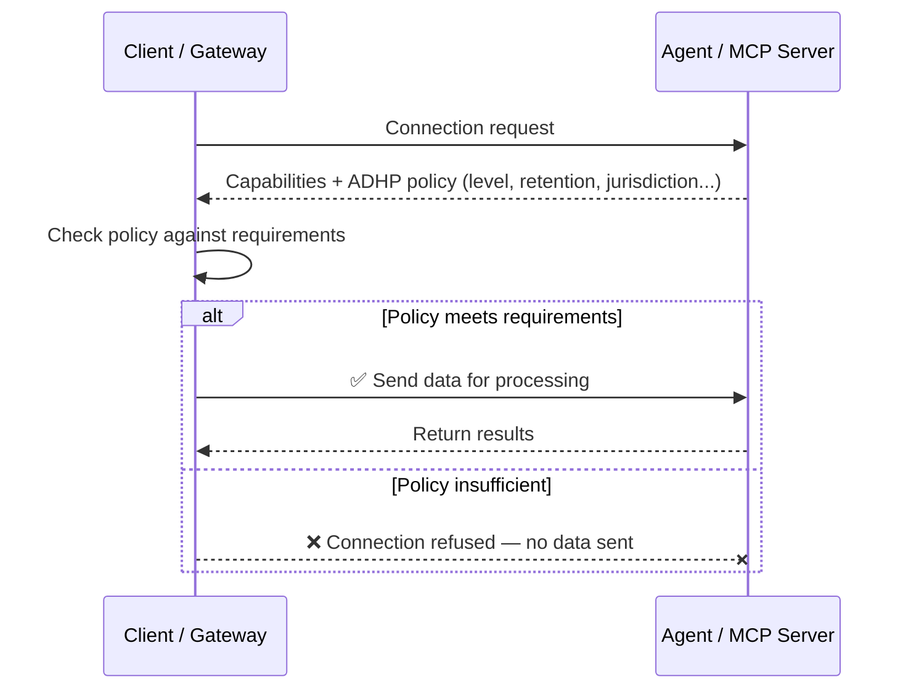

# Agent Data Handling Policy (ADHP)

[](https://github.com/StevenJohnson998/agent-data-handling-policy/actions/workflows/validate.yml)
[](LICENSE)
[](SPEC.md)

### AI agents are about to handle your most sensitive data. There's no standard way to know what they do with it.

---

**📑 Contents:** [The Problem](#the-problem) · [The Solution](#the-solution) · [Five Levels](#five-levels-of-data-handling) · [See It in Action](#see-it-in-action) · [How It Works](#how-it-works) · [Trust Roadmap](#beyond-declarations--the-trust-roadmap) · [Regulatory Landscape](#regulatory-landscape) · [For Developers](#for-developers) · [Status & Roadmap](#project-status) · [Join the Conversation](#join-the-conversation)

---

## The Problem

A company asks an AI recruiting agent to find a senior developer. That agent calls a background check agent, which calls a credit score agent, which calls an identity verification agent. The candidate's CV, employment history, social security number, and biometric data just crossed four services — in seconds, with no visibility into what each service does with that data.


> **At each step: does the agent store your data? Use it for training? Share it with third parties? Process it in which country?** Today, there is no standard way to know.

This isn't hypothetical. [MCP](https://modelcontextprotocol.io) (Anthropic) has 97M+ monthly SDK downloads. [A2A](https://google.github.io/A2A) (Google) connects agents to agents. The infrastructure for autonomous agent chains is here — the privacy layer is not.

---

## The Solution

ADHP is an open specification — a **machine-readable privacy passport for AI agents**.

Systems read it at runtime and decide whether or not to allow the agent to access your data. No valid passport? No entry.



> The key: the compliance check happens **before** any data reaches the agent.

---

## Five Levels of Data Handling

| | Level | Name | What It Means |
|:-:|:-----:|------|--------------|
| 🔴 | 0 | **Open** | No promises. Data may be used for anything, stored forever, shared freely. |
| 🟠 | 1 | **Standard** | No training on your data. Defined retention period. Metadata logging only. |
| 🟡 | 2 | **Sensitive** | Short retention. PII protected. Outputs scrubbed of source data. |
| 🟢 | 3 | **Strict** | No logging, no third-party sharing. Tight delegation controls. |
| 🔵 | 4 | **Zero-Trace** | Memory-only processing. No disk. No logs. No delegation. Data vanishes after processing. |

> Full level definitions, all properties, and edge cases → [SPEC.md](SPEC.md)

---

## See It in Action

> ### 🎮 [Try the Interactive Playground →](https://iamagique.dev/adhp-demo/playground)
> Configure client requirements and server declarations, then watch ADHP compliance checking happen in real time.
>
> ### 🔌 [Explore the Live MCP Demo →](https://iamagique.dev/adhp-demo/mcp)
> A real MCP server declaring its ADHP policy — inspect what a privacy-aware agent looks like in practice.

<!-- TODO: Add screenshot of playground once mobile-friendly version is deployed -->

---

## How It Works

ADHP plugs into two protocols that are shaping the agent ecosystem:

| Protocol | By | Purpose |
|----------|----|---------|
| **[MCP](https://modelcontextprotocol.io)** | Anthropic | Connects AI agents to tools and data sources |
| **[A2A](https://google.github.io/A2A)** | Google | Connects agents to other agents |

ADHP extends both with **data handling transparency**.

When two systems connect, they exchange capabilities in a "handshake." ADHP adds data handling declarations to this handshake — so the client knows *before sending any data* what the server will do with it.



### Delegation cascading

When agents delegate to other agents, privacy requirements are enforced at every step. The level can stay the same or go up — never down.


> Technical deep dive: [SPEC.md](SPEC.md) · [Architecture discussion](https://github.com/StevenJohnson998/agent-data-handling-policy/discussions/6)

---

## Beyond Declarations — The Trust Roadmap

*"But what if an agent lies about its policy?"*

Fair question. ADHP starts with self-declaration and progressively builds toward cryptographic guarantees — similar to how blockchain moved from "trust me" to "verify on-chain":

| Phase | What | Trust Level |
|:-----:|------|:-----------:|
| 📝 | **Self-Declaration** — Agents declare their practices | Reputation-based |
| ✅ | **Verified Badge** — KYC for operators + technical audit | Audit-backed |
| 🤖 | **Automated Auditing** — Auditor agents test with canary data | Test-proven |
| 🔐 | **Cryptographic Proof** — TEE attestation, signed code, ZK proofs | Mathematically proven |

Each phase raises the cost of lying. Today, ADHP makes data handling transparent. Tomorrow, it makes violations detectable and provable.

> Deep dive: [Enforcement patterns](https://github.com/StevenJohnson998/agent-data-handling-policy/discussions/5) · [DPA verification](https://github.com/StevenJohnson998/agent-data-handling-policy/discussions/8)

---

## Regulatory Landscape

ADHP is **regulation-agnostic** — it provides the technical transparency layer that multiple regulatory frameworks require but none currently have tooling for:

| Regulation | What It Requires | How ADHP Helps |
|-----------|-----------------|---------------|
| **GDPR** (EU) | Controller accountability for every sub-processor ([Art. 28](https://gdpr-info.eu/art-28-gdpr/)) | Machine-readable data handling declarations across the full agent chain |
| **EU AI Act** | Transparency obligations for AI systems ([Art. 50](https://artificialintelligenceact.eu/article/50/)) | Agents declare practices in a standardized, inspectable format |
| **HIPAA** (US) | Business Associate Agreements for health data | Agents declare health PII handling, filterable at discovery |
| **CCPA** (US) | Consumer right to know about data sharing | Third-party sharing practices declared and verifiable |

> ⚠️ ADHP does not replace legal compliance. It is a **due diligence and transparency tool** that makes compliance demonstrable. The same agent can be compliant for one processing activity and non-compliant for another — ADHP makes this visible.

<!-- TODO: Update discussion links once compliance category is created -->
> Regulatory discussions: [Jurisdiction challenges](https://github.com/StevenJohnson998/agent-data-handling-policy/discussions/7) · [EU AI Act & the regulatory gap](https://github.com/StevenJohnson998/agent-data-handling-policy/discussions/4)

---

## For Developers

### Python SDK (coming soon to PyPI)

<!-- TODO: Update this section once SDK is published — replace "coming soon" with pip install adhp -->

Server-side — declare your agent's ADHP policy in 3 lines:

```python
from adhp import ADHPServer

server = ADHPServer(
    name="FinanceAnalyzer Pro",
    config="adhp-config.json"  # your ADHP policy
)

@server.tool()
def analyze(data: str) -> str:
    return "analysis result"

server.run()
```

Client-side — check any server's compliance before sending data:

```python
from adhp import ADHPClient

client = ADHPClient(requirements={"min_level": "strict", "require_compliance": ["GDPR"]})
result = client.check("http://localhost:8000/mcp")

if not result.compliant:
    for check in result.checks:
        if not check.passed:
            print(f"  ✗ {check.name}: {check.reason}")
```

CLI:
```bash
adhp check http://localhost:8000/mcp --min-level strict --require-compliance GDPR
adhp validate adhp-config.json
adhp init --level standard --compliance GDPR --jurisdiction DE
```

> Full SDK documentation: [docs/sdk-guide.md](docs/sdk-guide.md) · Examples: [examples/](examples/)

---

## Related Projects

| Project | What | Link |
|---------|------|------|
| **Agent Registry** | Trust-based discovery for AI agents — find the right agent, verified. Uses ADHP natively. | [GitHub](https://github.com/StevenJohnson998/agent-registry) |
| **MCP** | Protocol for AI agent ↔ tool communication (Anthropic) | [modelcontextprotocol.io](https://modelcontextprotocol.io) |
| **A2A** | Protocol for agent ↔ agent communication (Google) | [google.github.io/A2A](https://google.github.io/A2A) |

---

## Project Status

**Version:** 0.2.0 (Draft) · **License:** [Apache 2.0](LICENSE)

This is a draft specification seeking community feedback. Not yet an official standard.

| Status | Milestone |
|:------:|-----------|
| ✅ | Spec v0.2.0 — 5 levels, delegation cascading, jurisdiction, third-party sharing |
| ✅ | Interactive playground & live MCP demo |
| ✅ | Python SDK with compliance checker and CLI |
| 🔜 | v0.3 — Jurisdiction modeling (guaranteed vs. possible) + compliance field overhaul |
| 🔜 | v0.4 — Cryptographic DPA verification + signed code attestation |
| 🎯 | Propose as MCP Extension (SEP process) |

---

## Join the Conversation

We're building this in the open. Feedback welcome from developers, DPOs, privacy engineers, legal practitioners, and anyone who cares about data privacy in an AI-powered world.

**🔧 Technical:**
- [Architecture — where ADHP sits in the stack](https://github.com/StevenJohnson998/agent-data-handling-policy/discussions/6)
- [Enforcement patterns — from self-declaration to cryptographic proof](https://github.com/StevenJohnson998/agent-data-handling-policy/discussions/5)

**⚖️ Compliance & Regulation:**
- [Jurisdiction modeling challenges](https://github.com/StevenJohnson998/agent-data-handling-policy/discussions/7)
- [DPA verification for agent chains](https://github.com/StevenJohnson998/agent-data-handling-policy/discussions/8)
- [EU AI Act & the regulatory gap](https://github.com/StevenJohnson998/agent-data-handling-policy/discussions/4)
- [Community discussion — Reddit r/gdpr](https://github.com/StevenJohnson998/agent-data-handling-policy/discussions/3)

Open a [Discussion](../../discussions) for ideas, an [Issue](../../issues) for bugs, or submit a PR.
