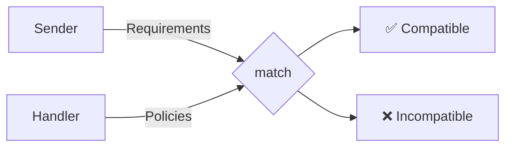

# Agent Data Handling Policy (ADHP)

[](LICENSE)
[](SPEC.md)
[](schemas/adhp-v0.3.schema.json)

### AI agents are about to handle your most sensitive data. There's no standard way to know what they do with it.

---

**Contents:** [The Problem](#the-problem) · [The Solution](#the-solution) · [Four Presets](#four-presets) · [How It Works](#how-it-works) · [See It in Action](#see-it-in-action) · [For Developers](#for-developers) · [Regulatory Landscape](#regulatory-landscape) · [Trust Roadmap](#beyond-declarations--the-trust-roadmap) · [Status](#project-status) · [Join the Conversation](#join-the-conversation)

---

## The Problem

A company asks an AI recruiting agent to find a senior developer. That agent calls a background check agent, which calls a credit score agent, which calls an identity verification agent. The candidate's CV, employment history, social security number, and biometric data just crossed four services — in seconds, with no visibility into what each service does with that data.


> **At each step: does the agent store your data? Use it for training? Share it with third parties? Process it in which country?** Today, there is no standard way to know.

This isn't hypothetical. [MCP](https://modelcontextprotocol.io) (Anthropic) has 97M+ monthly SDK downloads. [A2A](https://google.github.io/A2A) (Google) connects agents to agents. The infrastructure for autonomous agent chains is here — the privacy layer is not.

---

## The Solution

ADHP is an open specification — a **machine-readable privacy language for AI agents**.

Two sides, one vocabulary:
- **Data handlers** declare what they do with data (policies).
- **Data senders** declare what they require (requirements).

A deterministic matching algorithm checks compatibility **before** any data is exchanged.



---

## Four Presets

Presets are named baselines — like Creative Commons licenses for data handling.

| Preset | Retention | Sharing | Key Guarantees |
|--------|-----------|---------|----------------|
| **`open`** | Legal maximum | Allowed | No restrictions beyond law. |
| **`standard`** | Explicit (required) | Allowed | No marketing, no profiling. `max_retention` mandatory. |
| **`strict`** | Session only | Prohibited | + No training, no research, no content logging. No delegation. |
| **`zero_trace`** | None | Prohibited | Nothing persists. No logs beyond legal floor. No delegation. |

Each preset level satisfies all lower requirements: a `strict` handler always matches a `standard` requirement.

**Extras** add constraints on top of any preset: `no_training`, `no_log`, `no_third_party`, `tee_execution`, `right_to_erasure`, and more. [Full list in the spec →](SPEC.md#71-enum)

---

## How It Works

### Bidirectional matching

```json
// Data handler declares:
{
  "adhp": "0.3",
  "policies": [{
    "framework": "gdpr",
    "preset": "standard",
    "extras": ["no_training"],
    "max_retention": "P6M",
    "jurisdiction": { "processing": ["DE"], "storage": ["DE"] }
  }]
}
```

```json
// Data sender requires:
{
  "adhp": "0.3",
  "require": [{
    "framework": "gdpr",
    "min_preset": "standard",
    "extras": ["no_training"],
    "accepted_jurisdictions": ["EU"],
    "max_retention": "P1Y"
  }]
}
```

The matching algorithm runs **six checks**: framework, preset level, extras, jurisdiction, data categories, and retention. All pass → compatible. Any fails → incompatible.

### Protocol integration

ADHP plugs into the agent ecosystem's connection layer:

| Protocol | Integration |
|----------|-------------|
| **[MCP](https://modelcontextprotocol.io)** (Anthropic) | Policy in the `capabilities` handshake. Client evaluates locally before sending data. |
| **[A2A](https://google.github.io/A2A)** (Google) | Policy in Agent Card `extensions`. Registries pre-filter by requirements. |

### Delegation cascading

When agents delegate to other agents, requirements travel through the chain. Each downstream handler must pass `match()` — requirements can only tighten, never loosen.


> `strict` and `zero_trace` presets prohibit delegation entirely — data stays with the handler.

---

## See It in Action

> ### [Try the Interactive Playground →](https://iamagique.dev/adhp-demo/playground)
> Configure sender requirements and handler policies, then watch ADHP matching happen in real time.

---

## For Developers

### Install the validator

```bash
pip install jsonschema
```

Then validate any ADHP document against the schema:

```bash
jsonschema -i my-policy.json schemas/adhp-v0.3.schema.json
```

Schema: [`schemas/adhp-v0.3.schema.json`](schemas/adhp-v0.3.schema.json) (JSON Schema draft 2020-12)

### Quick start

The simplest valid policy:

```json
{ "adhp": "0.3", "policies": [{ "framework": "gdpr", "preset": "open" }] }
```

A responsible baseline (most common):

```json
{
  "adhp": "0.3",
  "policies": [{
    "framework": "gdpr",
    "preset": "standard",
    "extras": ["no_training"],
    "max_retention": "P1Y",
    "jurisdiction": { "processing": ["EU"], "storage": ["EU"] }
  }]
}
```

### Python SDK (v0.3 coming soon)

```python
from adhp import match

result = match(handler_policy, sender_requirements)
if result.compatible:
    # Route to matched policy flow
    print(f"Matched: {result.matched_policies}")
else:
    # Inspect failures
    for f in result.failures:
        print(f"  ✗ {f.check}: {f.message}")
```

> Full specification: [SPEC.md](SPEC.md) · Examples: [examples/](examples/)

---

## Regulatory Landscape

ADHP is **framework-aware** — each policy declares which regulatory framework it supports. The matching algorithm ensures framework-specific requirements are met.

| Framework | What It Requires | How ADHP Helps |
|-----------|-----------------|---------------|
| **GDPR** (EU) | Controller accountability for every sub-processor (Art. 28) | Machine-readable declarations across full delegation chains |
| **UK GDPR** | Same obligations, UK-specific context | Separate framework ID enables distinct preset semantics |
| **EU AI Act** | Transparency obligations for AI systems (Art. 50) | Standardized, inspectable data handling format |
| **CCPA** (US) | Consumer right to know about data sharing | Sharing practices declared and verifiable at match time |
| **HIPAA** (US) | Business Associate Agreements for health data | Health data handling declarations with sector-specific preset semantics |

> ADHP does not replace legal compliance. It provides a common vocabulary and grammar for systems to communicate about regulations — not a substitute for DPAs, DPIAs, or legal agreements.

---

## Beyond Declarations — The Trust Roadmap

*"But what if an agent lies about its policy?"*

ADHP starts with protocol definition and progressively builds toward verifiable guarantees:

| Phase | What | Trust Level |
|:-----:|------|:-----------:|
| **0** | **Protocol Definition** — Define the language, schema, matching algorithm | N/A — spec stage |
| 1 | **Self-Declaration** — Agents declare their practices in ADHP | Reputation-based |
| 2 | **Verified Badge** — Operator KYC + technical audit | Audit-backed |
| 3 | **Automated Auditing** — Auditor agents test with canary data | Test-proven |
| 4 | **Cryptographic Proof** — TEE attestation, signed code, ZK proofs | Mathematically proven |

**We are here: Phase 0.** The specification is being defined and reviewed. Each subsequent phase raises the cost of lying — from transparent declarations to mathematically provable guarantees.

---

## Project Status

**Version:** 0.3.0 (Draft) · **License:** [Apache 2.0](LICENSE)

| Status | Milestone |
|:------:|-----------|
| ✅ | Spec v0.2 — 5 levels, delegation cascading |
| ✅ | Interactive playground & live MCP demo |
| ✅ | **Spec v0.3** — Framework-based presets, bidirectional matching, extras, JSON Schema |
| 🔜 | Python SDK update for v0.3 |
| 🔜 | v0.4 — Autonomous vs DPA delegation, sub-processor declarations, `case` retention |
| 🎯 | Propose as MCP extension |

---

## Join the Conversation

We're building this in the open. Feedback welcome from developers, DPOs, privacy engineers, legal practitioners, and anyone who cares about data privacy in an AI-powered world.

- [Architecture — where ADHP sits in the stack](https://github.com/StevenJohnson998/agent-data-handling-policy/discussions/6)
- [Enforcement patterns — from self-declaration to cryptographic proof](https://github.com/StevenJohnson998/agent-data-handling-policy/discussions/5)
- [Complex jurisdiction modeling](https://github.com/StevenJohnson998/agent-data-handling-policy/discussions/8)
- [EU AI Act & the autonomous agent compliance problem](https://github.com/StevenJohnson998/agent-data-handling-policy/discussions/4)

Open a [Discussion](https://github.com/StevenJohnson998/agent-data-handling-policy/discussions) for ideas, an [Issue](https://github.com/StevenJohnson998/agent-data-handling-policy/issues) for bugs, or submit a PR.
