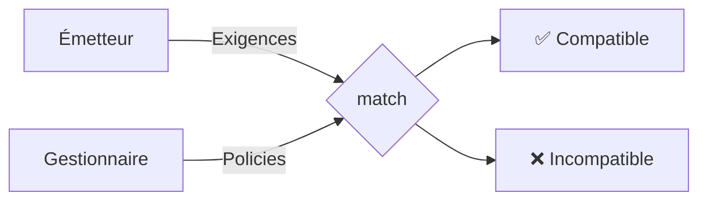

# Agent Data Handling Policy (ADHP)

[](LICENSE)
[](SPEC.md)
[](schemas/adhp-v0.3.schema.json)

🌐 **Langue :** Français · [English](README.md)

### Les agents IA s'apprêtent à manipuler vos données les plus sensibles. Il n'existe aucun moyen standard de savoir ce qu'ils en font.

---

> **Note sur la terminologie.** Les identifiants techniques d'ADHP (noms de presets comme `standard`, valeurs d'`extras` comme `no_training`, IDs de frameworks comme `gdpr`, clés JSON, `match()`…) sont des **valeurs littérales du schéma** : elles restent en anglais, à l'identique de la spec et des documents ADHP réels. Seule la prose explicative est traduite. Les traduire produirait des documents invalides.

---

**Sommaire :** [Le problème](#le-problème) · [La solution](#la-solution) · [Les quatre presets](#les-quatre-presets) · [Fonctionnement](#fonctionnement) · [Démonstration](#démonstration) · [Pour les développeurs](#pour-les-développeurs) · [Paysage réglementaire](#paysage-réglementaire) · [Feuille de route confiance](#au-delà-des-déclarations--la-feuille-de-route-confiance) · [Statut](#statut-du-projet) · [Participer](#rejoindre-la-conversation)

---

## Le problème

Une entreprise demande à un agent IA de recrutement de trouver un développeur senior. Cet agent appelle un agent de vérification d'antécédents, qui appelle un agent de scoring de crédit, qui appelle un agent de vérification d'identité. Le CV du candidat, son historique professionnel, son numéro de sécurité sociale et ses données biométriques viennent de traverser quatre services — en quelques secondes, sans aucune visibilité sur ce que chaque service fait de ces données.


> **À chaque étape : l'agent stocke-t-il vos données ? Les utilise-t-il pour l'entraînement ? Les partage-t-il avec des tiers ? Dans quel pays les traite-t-il ?** Aujourd'hui, il n'existe aucun moyen standard de le savoir.

Ce n'est pas hypothétique. [MCP](https://modelcontextprotocol.io) (Anthropic) compte plus de 97 M de téléchargements de SDK par mois. [A2A](https://google.github.io/A2A) (Google) connecte les agents entre eux. L'infrastructure des chaînes d'agents autonomes est là — la couche de confidentialité, non.

---

## La solution

ADHP est une spécification ouverte — un **langage de confidentialité lisible par la machine, destiné aux agents IA**.

Deux côtés, un vocabulaire commun :
- Les **gestionnaires de données** (*data handlers*) déclarent ce qu'ils font des données (leurs `policies`).
- Les **émetteurs de données** (*data senders*) déclarent ce qu'ils exigent (leurs `require`).

Un algorithme de matching déterministe vérifie la compatibilité **avant** tout échange de données.



---

## Les quatre presets

Les presets sont des profils de référence nommés — comme les licences Creative Commons, mais pour le traitement des données.

| Preset | Rétention | Partage | Garanties clés |
|--------|-----------|---------|----------------|
| **`open`** | Maximum légal | Autorisé | Aucune restriction au-delà de la loi. |
| **`standard`** | Explicite (obligatoire) | Autorisé | Pas de marketing, pas de profilage. `max_retention` obligatoire. |
| **`strict`** | Session uniquement | Interdit | + Pas d'entraînement, pas de recherche, pas de journalisation du contenu. Pas de délégation. |
| **`zero_trace`** | Aucune | Interdit | Rien ne persiste. Aucun journal au-delà du minimum légal. Pas de délégation. |

Chaque niveau de preset satisfait toutes les exigences des niveaux inférieurs : un gestionnaire `strict` satisfait toujours une exigence `standard`.

Les **extras** ajoutent des contraintes par-dessus n'importe quel preset : `no_training`, `no_log`, `no_third_party`, `tee_execution`, `right_to_erasure`, et d'autres. [Liste complète dans la spec →](SPEC.md#71-enum)

---

## Fonctionnement

### Matching bidirectionnel

```json
// Le gestionnaire de données déclare :
{
  "adhp": "0.3",
  "policies": [{
    "frameworks": ["gdpr"],
    "preset": "standard",
    "extras": ["no_training"],
    "max_retention": "P6M",
    "jurisdiction": { "processing": ["DE"], "storage": ["DE"] }
  }]
}
```

```json
// L'émetteur de données exige :
{
  "adhp": "0.3",
  "require": [{
    "frameworks": ["gdpr"],
    "min_preset": "standard",
    "extras": ["no_training"],
    "accepted_jurisdictions": ["EU"],
    "max_retention": "P1Y"
  }]
}
```

L'algorithme de matching exécute **six contrôles** : frameworks, niveau de preset, extras, juridiction, catégories de données et rétention. Tous passent → compatible. Un seul échoue → incompatible.

### Intégration aux protocoles

ADHP s'insère dans la couche de connexion de l'écosystème d'agents :

| Protocole | Intégration |
|-----------|-------------|
| **[MCP](https://modelcontextprotocol.io)** (Anthropic) | La policy est placée dans le handshake `capabilities`. Le client l'évalue localement avant d'envoyer des données. |
| **[A2A](https://google.github.io/A2A)** (Google) | La policy est placée dans les `extensions` de l'Agent Card. Les registres pré-filtrent selon les exigences. |

### Cascade de délégation

Quand des agents délèguent à d'autres agents, les exigences voyagent à travers la chaîne. Chaque gestionnaire en aval doit passer `match()` — les exigences ne peuvent que se resserrer, jamais s'assouplir.


> Les presets `strict` et `zero_trace` interdisent toute délégation — les données restent chez le gestionnaire.

---

## Démonstration

> ### [Essayer le démonstrateur interactif →](https://iamagique.dev/adhp-demo/playground)
> Configurez les exigences de l'émetteur et les policies du gestionnaire, puis observez le matching ADHP se dérouler en temps réel. *(Le démonstrateur est bilingue : bouton FR/EN en haut à droite.)*

---

## Pour les développeurs

### Installer le validateur

```bash
pip install jsonschema
```

Validez ensuite n'importe quel document ADHP contre le schéma :

```bash
jsonschema -i my-policy.json schemas/adhp-v0.3.schema.json
```

Schéma : [`schemas/adhp-v0.3.schema.json`](schemas/adhp-v0.3.schema.json) (JSON Schema draft 2020-12)

### Démarrage rapide

La policy valide la plus simple :

```json
{ "adhp": "0.3", "policies": [{ "frameworks": ["gdpr"], "preset": "open" }] }
```

Une base responsable (la plus courante) :

```json
{
  "adhp": "0.3",
  "policies": [{
    "frameworks": ["gdpr"],
    "preset": "standard",
    "extras": ["no_training"],
    "max_retention": "P1Y",
    "jurisdiction": { "processing": ["EU"], "storage": ["EU"] }
  }]
}
```

### SDK Python (v0.3 bientôt disponible)

```python
from adhp import match

result = match(handler_policy, sender_requirements)
if result.compatible:
    # Router vers le flux de la policy compatible
    print(f"Matched: {result.matched_policies}")
else:
    # Inspecter les échecs
    for f in result.failures:
        print(f"  ✗ {f.check}: {f.message}")
```

> Spécification complète : [SPEC.md](SPEC.md) · Exemples : [examples/](examples/)

---

## Paysage réglementaire

ADHP est **framework-aware** (conscient des cadres réglementaires) — chaque policy déclare quel cadre réglementaire elle prend en charge. L'algorithme de matching garantit que les exigences propres à chaque cadre sont satisfaites.

| Cadre | Ce qu'il exige | Comment ADHP aide |
|-------|----------------|-------------------|
| **GDPR / RGPD** (UE) | Responsabilité du responsable de traitement pour chaque sous-traitant (Art. 28) | Déclarations lisibles par la machine sur l'ensemble des chaînes de délégation |
| **UK GDPR** | Mêmes obligations, contexte propre au Royaume-Uni | Un ID de framework distinct permet des sémantiques de preset spécifiques |
| **EU AI Act** | Obligations de transparence pour les systèmes d'IA (Art. 50) | Format de traitement des données standardisé et inspectable |
| **CCPA** (US) | Droit du consommateur de savoir avec qui ses données sont partagées | Pratiques de partage déclarées et vérifiables au moment du match |
| **HIPAA** (US) | Accords de sous-traitance (BAA) pour les données de santé | Déclarations de traitement des données de santé avec sémantiques de preset propres au secteur |

> ADHP ne remplace pas la conformité juridique. Il fournit un vocabulaire et une grammaire communs pour que les systèmes communiquent au sujet des réglementations — ce n'est pas un substitut aux DPA, AIPD/DPIA ou accords juridiques.

---

## Au-delà des déclarations — la feuille de route confiance

*« Mais que se passe-t-il si un agent ment sur sa policy ? »*

ADHP est un langage, pas un mécanisme d'application (*enforcement*). La vérification est assurée par des parties externes — ADHP fournit seulement des **champs pour déclarer le statut de vérification**. Chaque phase ajoute des métadonnées qui augmentent le coût du mensonge :

| Phase | Quoi | Rôle d'ADHP |
|:-----:|------|:-----------:|
| **0** | **Définition du protocole** — Définir le langage, le schéma, l'algorithme de matching | La spec elle-même |
| 1 | **Auto-déclaration** — Les agents déclarent leurs pratiques | Champs de policy (actuel) |
| 2 | **Audit tiers** — Des auditeurs externes vérifient les pratiques | Champs : `audited_by`, `audit_date`, `audit_url` |
| 3 | **Tests automatisés** — Des agents auditeurs testent avec des données canaris | Champs : `last_tested`, `test_result`, `tester_id` |
| 4 | **Attestation cryptographique** — TEE, code signé, preuves ZK | Champs : `attestation`, `signature`, `tee_report_url` |

**Nous sommes ici : Phase 0.** ADHP est conçu comme une couche de fondation sur laquelle bâtir des systèmes de vérification et d'application. Chaque phase ajoute des champs de métadonnées pour enregistrer que la vérification a eu lieu, qui l'a effectuée, et comment la contrôler.

---

## Statut du projet

**Version :** 0.3.0 (Draft) · **Licence :** [Apache 2.0](LICENSE)

| Statut | Jalon |
|:------:|-------|
| ✅ | Spec v0.2 — 5 niveaux, cascade de délégation |
| ✅ | Démonstrateur interactif & démo MCP en direct |
| ✅ | **Spec v0.3** — Presets par framework, matching bidirectionnel, extras, JSON Schema |
| 🔜 | Mise à jour du SDK Python pour v0.3 |
| 🔜 | v0.4 — Délégation autonome vs DPA, déclarations de sous-traitants, rétention `case` |
| 🎯 | Proposer comme extension MCP |

---

## Rejoindre la conversation

Nous construisons ce projet à ciel ouvert. Les retours sont les bienvenus de la part des développeurs, DPO, ingénieurs confidentialité, juristes, et de toute personne attachée à la protection des données dans un monde piloté par l'IA.

- [Architecture — où ADHP se situe dans la stack](https://github.com/StevenJohnson998/agent-data-handling-policy/discussions/6)
- [Modèles d'application — de l'auto-déclaration à la preuve cryptographique](https://github.com/StevenJohnson998/agent-data-handling-policy/discussions/5)
- [Modélisation de juridictions complexes](https://github.com/StevenJohnson998/agent-data-handling-policy/discussions/8)
- [EU AI Act & le problème de conformité des agents autonomes](https://github.com/StevenJohnson998/agent-data-handling-policy/discussions/4)

Ouvrez une [Discussion](https://github.com/StevenJohnson998/agent-data-handling-policy/discussions) pour des idées, une [Issue](https://github.com/StevenJohnson998/agent-data-handling-policy/issues) pour des bugs, ou soumettez une PR.
